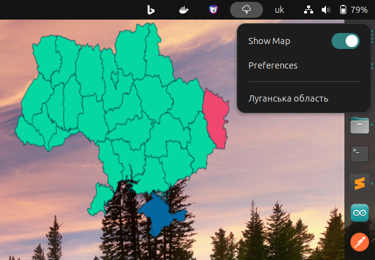

# Air raid widget for Linux



This widget shows the current status of air raid sirens in Ukraine. The data is pulled every 20 seconds
from the [air-raid-monitor](https://ubilling.net.ua/aerialalerts/) API. 
Originally developed on the basis of [air-raid-widget-linux](https://github.com/dr-mod/air-raid-widget-linux)


## Installation

### Gnome

1. Install Gnome extensions
   ```
   sudo apt install gnome-shell-extensions
   ```
2. Download the widget
   ```
   git clone git@github.com:diver90/air-raid-widget.git
   ```
3. Make install.sh executable and run it
4. If you wish to disable widget, run
   ```
   gnome-extensions disable air-raid-widget@unibot.top
   ```
   widgets can also be configured though other GUI management tools available in your distro, e.g. Tweaks, _Tweaks -> Extensions_. 

